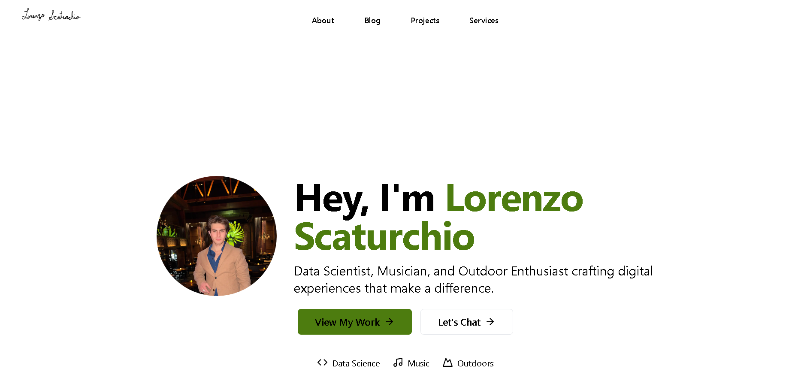

# lscaturchio.xyz – Personal Portfolio and Blog



Welcome to the repository for my personal website, **lscaturchio.xyz**! This project serves as a dynamic platform where I showcase my professional work, share technical insights through blog posts, and engage with the broader tech community.

## 🌟 Key Features

- **🚀 Powered by Next.js 14**: Utilizes the App Router and React Server Components for efficient, scalable, and production-ready web applications.
- **🤖 AI Chat with RAG**: GPT-4o powered chat that answers questions using blog content via retrieval-augmented generation.
- **📊 Engagement Tracking**: View counts, likes, and bookmarks persisted in Supabase with server-side deduplication.
- **💅 Styled with Tailwind CSS**: A utility-first CSS framework ensuring rapid and consistent design implementation.
- **🎨 Interactive Animations**: Smooth, responsive animations created with Framer Motion for an engaging UI.
- **📝 MDX Integration**: Blog posts with syntax highlighting, series support, and React component flexibility.
- **📱 Fully Responsive**: Optimized for all devices, from desktop monitors to smartphones.
- **🎯 SEO-Optimized**: Structured data (JSON-LD), automated sitemap/RSS generation, and Open Graph support.
- **📄 Dynamic Content**: Modular blog and project pages with bento grid layouts.
- **📬 Contact Form**: Email integration via Resend API with rate limiting.
- **📰 Newsletter**: Subscription system with welcome emails and Supabase persistence.

## 📂 Project Structure

This repository follows a clean and modular structure for ease of navigation and maintainability:

- **`/src/app/*`**: Core application pages and dynamic routing managed by Next.js.  
- **`/src/components/*`**: Reusable and customizable UI components to ensure consistency and scalability.  
- **`/public/*`**: Static assets such as images, icons, and fonts accessible by the client.  
- **`/lib/*`**: Shared utility functions, API integrations, and configuration files.  
- **`/fonts/*`**: Custom typography resources to ensure a unique and polished look.  

## 🛠️ Built With

This project leverages a modern tech stack to deliver exceptional performance and developer experience:

- **[Next.js 14](https://nextjs.org/)**: The React framework for modern web development, with App Router, Server Components, and more.
- **[Bun](https://bun.sh/)**: Fast all-in-one JavaScript runtime and package manager.
- **[TypeScript](https://www.typescriptlang.org/)**: Ensures strong typing for improved code quality and maintainability.
- **[Tailwind CSS](https://tailwindcss.com/)**: Rapid UI design using a utility-first CSS framework.
- **[Supabase](https://supabase.com/)**: PostgreSQL database with vector search for engagement tracking and AI chat.
- **[Framer Motion](https://www.framer.com/motion/)**: A powerful animation library for creating stunning motion effects.
- **[MDX](https://mdxjs.com/)**: Combines Markdown and JSX for flexible, component-driven content.  

## 🚀 Getting Started

Follow these steps to set up and run the project locally:

1. **Clone the Repository**:
   ```bash
   git clone https://github.com/lscaturchio/lscaturchio.xyz.git
   cd lscaturchio.xyz
   ```

2. **Install Dependencies**:
   ```bash
   bun install
   ```

3. **Run the Development Server**:
   ```bash
   bun dev
   ```

4. **View in Browser**: Open [http://localhost:3000](http://localhost:3000) to preview the site locally.

## 🤖 Content Pipelines

```bash
# Regenerate RAG embeddings (requires DATABASE_URL and OpenAI/Ollama)
npm run generate-embeddings

# Build Matisse-style blog cover prompts only
npm run generate-matisse-covers -- --prepare-only

# Generate + apply Matisse-style blog covers (requires OPENAI_API_KEY)
npm run generate-matisse-covers -- --force

# Generate missing blog audio with OpenAI TTS (requires OPENAI_API_KEY)
npm run generate-tts-openai

# Audit generated media footprint and coverage
npm run audit-media
```

## 📈 Deployment

The website is deployed using [Vercel](https://vercel.com/), ensuring rapid and reliable performance with automatic CI/CD pipelines. For production deployment:

1. Connect your GitHub repository to Vercel.  
2. Push changes to the `main` branch to trigger an automatic build and deployment.  

## 📜 License

This project is open-source and available under the terms of the [MIT License](LICENSE). Contributions and forks are welcome, adhering to the license terms.

## 🙌 Acknowledgments

Special thanks to [Aceternity UI](https://ui.aceternity.com/templates) for inspiring the design aesthetics of this website. 

---

By contributing to or using this project, you’re joining a journey toward fostering creativity and innovation in the tech community. Feel free to explore, contribute, or reach out for collaboration opportunities! 🚀
