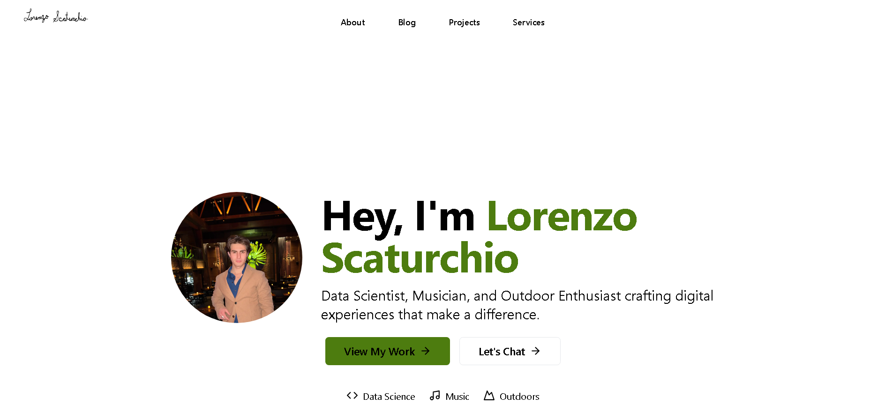

# lscaturchio.xyz



Personal site and publishing platform built with Next.js 16, React 19, TypeScript, and Tailwind CSS. The repo powers a portfolio, long-form MDX blog, AI chat with retrieval over site content, engagement APIs, localized routes, and a set of maintenance scripts for content, audio, and deployment checks.

## What This Repo Includes

- Marketing and portfolio pages under the App Router
- MDX blog posts with shared metadata, tags, series, and JSON-LD
- AI chat with OpenAI, OpenRouter, and Ollama fallbacks
- Neon/Postgres-backed engagement and content retrieval features
- Pre-generated text-to-speech audio and an audio manifest pipeline
- CI quality gates for linting, type-checking, tests, build, and Lighthouse

## Stack

- Next.js 16 App Router
- React 19
- TypeScript
- Tailwind CSS
- Neon/Postgres
- OpenAI, OpenRouter, and Ollama
- Playwright, Vitest, ESLint, Lighthouse CI
- Vercel deployment

## Quick Start

Examples below use `npm`, but the repo also keeps a Bun lockfile and CI uses Bun.

```bash
git clone https://github.com/gr8monk3ys/lscaturchio.xyz.git
cd lscaturchio.xyz
cp .env.example .env.local
npm install
npm run dev
```

Open `http://localhost:3000`.

For full local functionality, set `DATABASE_URL` and whichever provider keys you want to use in `.env.local`. The environment file is documented in [`.env.example`](.env.example).

## Common Commands

```bash
# App lifecycle
npm run dev
npm run build
npm run start

# Code quality
npm run lint
npm run typecheck
npm test
npm run test:e2e
npm run perf:lighthouse

# Content and operations
npm run generate-embeddings
npm run generate-tts-openai
npm run generate-audio-manifest
npm run audit-media
npm run suggest-internal-links
npm run send-webmentions
npm run smoke:chat
npm run smoke:chat:prod
```

## Repository Map

- `src/app`: App Router pages, layouts, route handlers, sitemap, and metadata routes
- `src/components`: page sections, UI primitives, and client-side behavior
- `src/lib`: shared data helpers, validation, SEO, chat, DB, and utility modules
- `src/generated`: generated source such as the audio manifest
- `public`: static assets, audio output, and `public/my-data` content exports used by retrieval workflows
- `scripts`: one-off and recurring maintenance scripts
- `e2e`: Playwright coverage for key user flows
- `supabase/migrations`: SQL migration history and database setup notes
- `docs`: repository-specific operating docs and structure notes

## Maintenance Notes

- The canonical sitemap comes from [`src/app/sitemap.ts`](src/app/sitemap.ts), not from a postbuild script.
- Generated or local-only artifacts such as `.next`, `coverage`, `playwright-report`, `test-results`, `.lighthouseci`, `.playwright-cli`, and `tmp` should stay out of commits.
- When audio files change, regenerate [`src/generated/audio-manifest.ts`](src/generated/audio-manifest.ts) with `npm run generate-audio-manifest`.
- When retrieval source content changes in `public/my-data`, rerun `npm run generate-embeddings` if you rely on the chat index.

## Further Docs

- [Repository Guide](docs/repository-guide.md)
- [Operations Guide](docs/operations.md)
- [Contributing](CONTRIBUTING.md)
- [Security Policy](SECURITY.md)
- [CLAUDE.md](CLAUDE.md)

## Deployment

Production deploys target Vercel from `main`. After a production deploy, the fastest app-level smoke check is:

```bash
npm run smoke:chat:prod
```

For preview or other environments:

```bash
npm run smoke:chat -- --base-url https://your-preview-url.vercel.app
```

## License

This project is licensed under the [MIT License](LICENSE).
