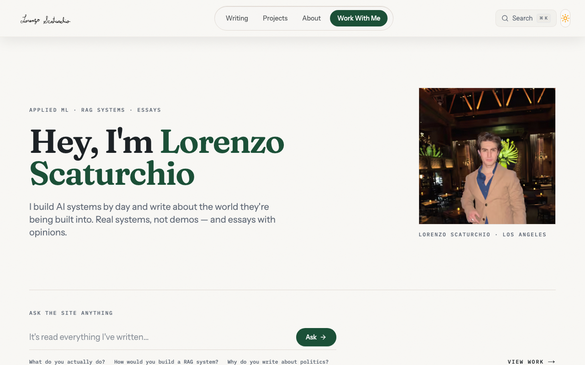

# lscaturchio.xyz

Personal site: 83 essays, a portfolio, and a chat box that answers from the essays. Live at https://lscaturchio.xyz.

Next.js 16 App Router, React 19, TypeScript, Tailwind, Neon Postgres, deployed on Vercel from `main`.



## One engineering note

Every public write endpoint is the same four-layer chain, and the contact form is the shortest example ([`src/app/api/contact/route.ts`](src/app/api/contact/route.ts)):

1. **Rate limit** — `withRateLimit(handler, { limit: 3, window: 5 min })` wraps the handler, so it runs before anything else. Upstash Redis when configured, an in-memory map otherwise; if Redis errors, the request degrades to the in-memory limiter instead of failing ([`src/lib/with-rate-limit.ts`](src/lib/with-rate-limit.ts)).
2. **CSRF** — `Origin` header checked against the site URL and the exact hostnames Vercel injects for this deployment, never a name prefix: anyone can register `lscaturchio-<x>.vercel.app` ([`src/lib/csrf.ts`](src/lib/csrf.ts)).
3. **Zod** — `contactFormSchema` trims and bounds name (100), email, message (5000); a failure is a 400 with the field error ([`src/lib/validations.ts`](src/lib/validations.ts)).
4. **Sanitise at the sink** — the email body is built from `escapeHtml`/`sanitizeForHtmlEmail`, and the subject through `sanitizeEmailSubject`, which strips `\r\n` so a name cannot inject mail headers ([`src/lib/sanitize.ts`](src/lib/sanitize.ts)).

Validation and sanitisation are separate on purpose: Zod decides whether the request is well-formed, the sanitisers decide what is safe in a given output (HTML, a header). Each layer has its own unit tests under `src/__tests__/lib/`, and `src/__tests__/api/contact.test.ts` covers the composition.

## Run

```bash
bun install --frozen-lockfile
cp .env.example .env.local     # DATABASE_URL is required for build; the rest is optional
bun run dev                    # http://localhost:3000
```

## Test

```bash
bun run lint            # eslint + knip + retrieval-corpus drift check
bun run typecheck
bun run test:coverage   # vitest, thresholds enforced
bun run build
bun run test:e2e        # playwright, builds and serves the app itself
bun run predeploy       # all of the above
```

CI runs the same five jobs on every PR and they are all required. `codeql.yml` scans weekly; `uptime.yml` probes production every 15 minutes and opens an issue after two consecutive runs find it genuinely down — an edge/WAF refusal that never reached the app is reported as blocked, not as an outage.

## Content

Essays are `src/app/blog/<slug>/content.mdx`. The chat corpus in `public/my-data/blog-*.md` is generated from them (`bun run sync-retrieval-corpus`), and CI fails if the two drift. Blog audio is served from Vercel Blob, not git. Procedures for embeddings, audio, database and monitoring are in [`docs/operations.md`](docs/operations.md); house style for essays is [`docs/writing-style.md`](docs/writing-style.md).

## License

[MIT](LICENSE).
